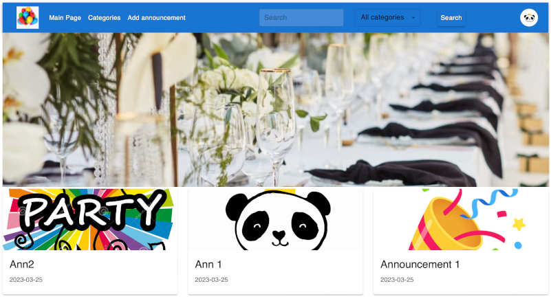
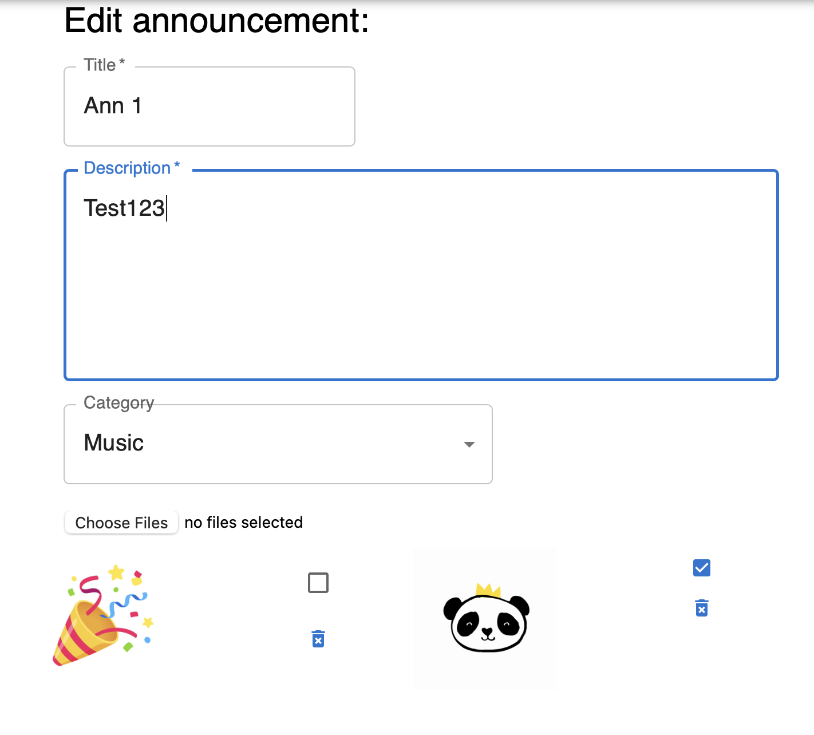
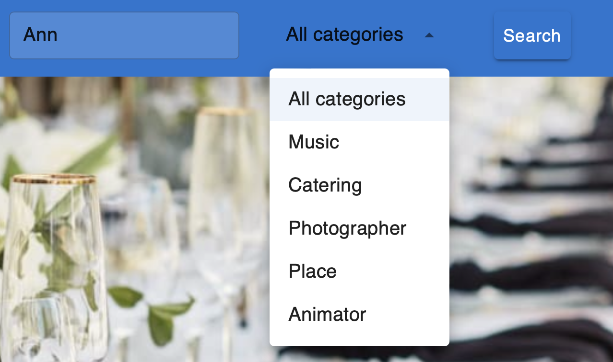
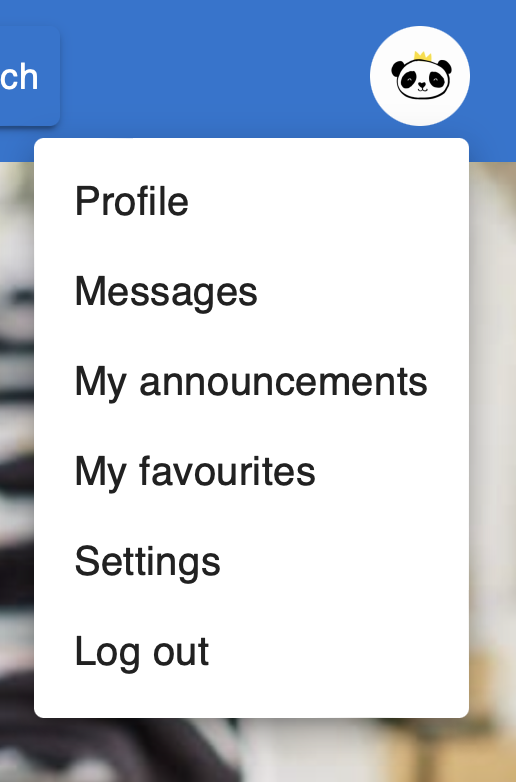
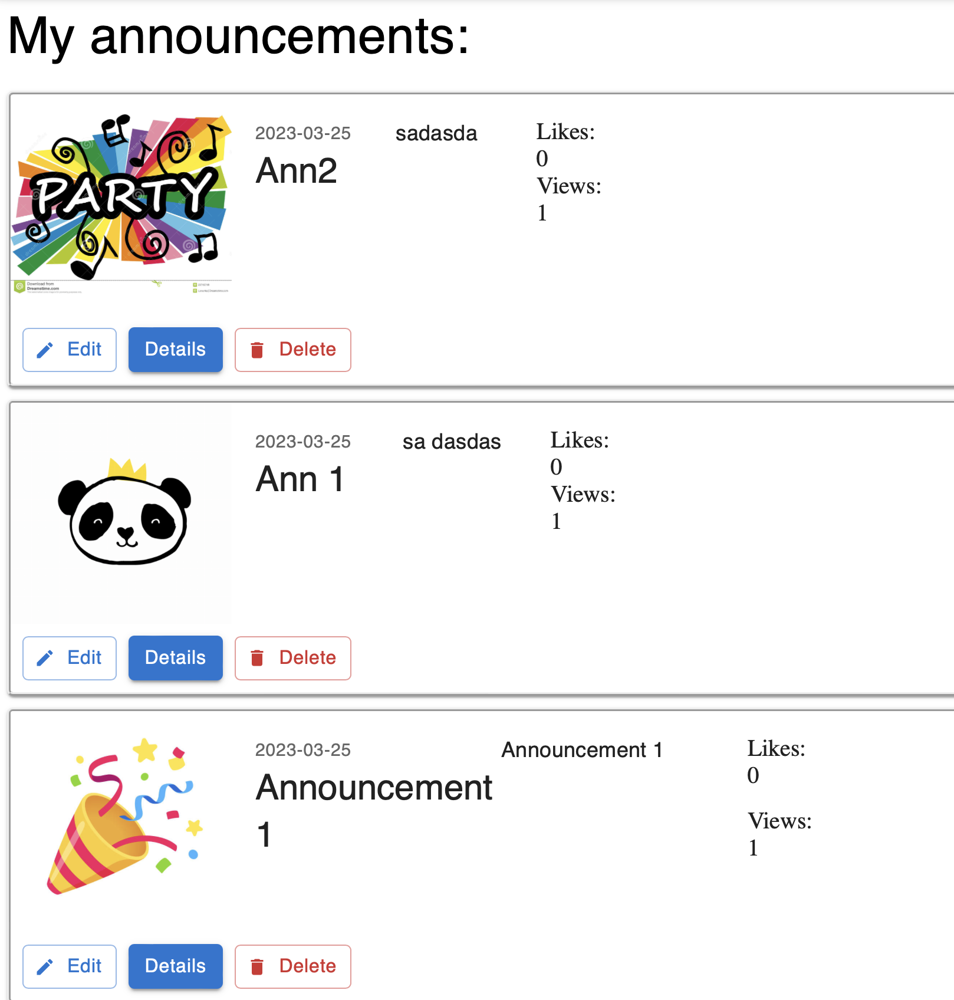
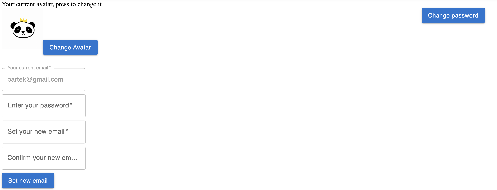
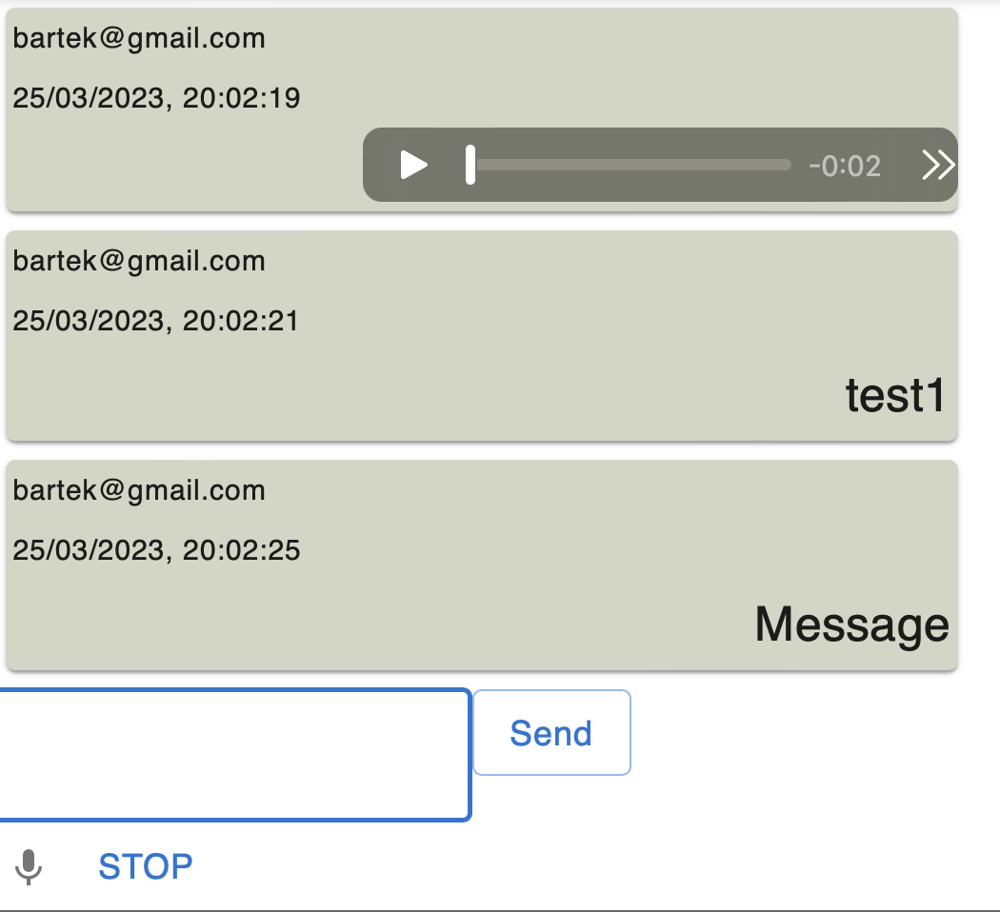

# PARTY WIZARD :)

**Service** that help you organize your life event:)

**Homepage**
lists 9 last announcements

**Edit form**  

**Search options**

**Profile functions**

**List of my announcements** including options

**Profile settings**
- avatar change
- change of login credentials with email confirmation

**Chatting**
with voice message.

_and more..._

_Work in progress..._

Technologies used in project:

- Django 4.0.7 (Python 3.11) - backend api
- React 17.2 (Javascript) - frontend
- Redux-Toolkit
- Postgresql 15 - database
- Redis - cashing data
- Docker - contenerization
- MUI
